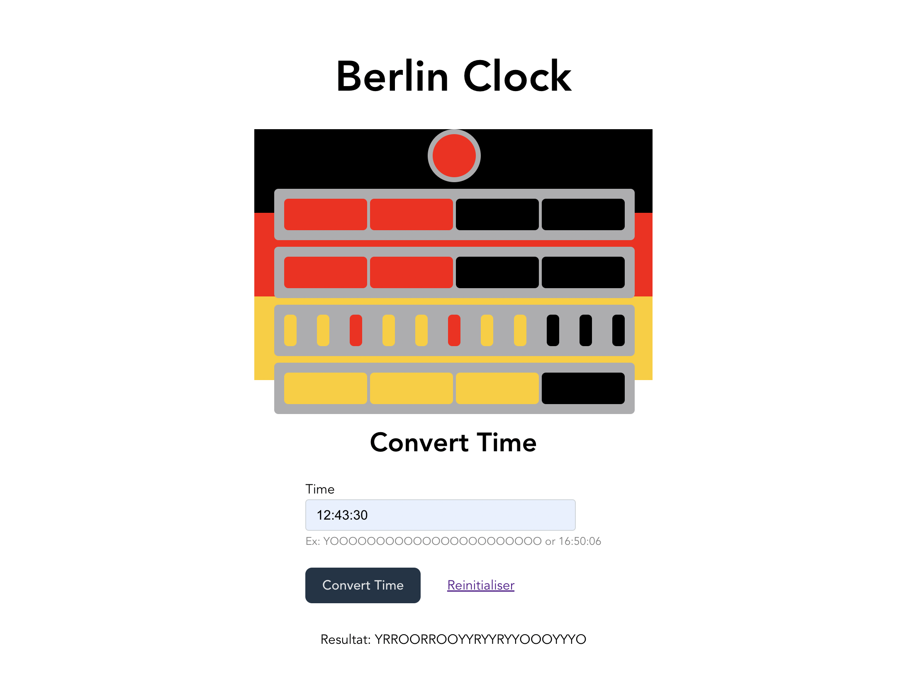

# berlin-clock

## The React Project for Berlin Clock Challenge

The Berlin Clock (Mengenlehreclock or Berlin Uhr) is a clock that tells the time using a series of illuminated coloured blocks, as you can see in the picture for this project.

The top lamp blinks to show seconds- it is illuminated on even seconds and off on odd seconds.

The next two rows represent hours. The upper row represents 5 hour blocks and is made up of 4 red lamps. The lower row represents 1 hour blocks and is also made up of 4 red lamps.

The final two rows represent the minutes. The upper row represents 5 minute blocks, and is made up of 11 lamps- every third lamp is red, the rest are yellow. The bottom row represents 1 minute blocks, and is made up of 4 yellow lamps.

## Feature 1 - Converting Digital Time to Berlin Time

So what we want first is a way to get a textual representation of a Berlin Clock time based on a digital time. This is so we can use this converter everywhere, all we have to do is hook up a frontend. We're going to be going over the clock row by row to make things clearer and ensure we get everything right first time.

## Feature 2 - Converting Berlin Time to Digital Time

The change to using Berlin Time has gone so well that we've decided to introduce it everywhere, from the clocks on the microwaves to the company-approved wristwatches. Unfortunately, people are having trouble quickly deciphering the current time which is having a detrimental effect on productivity. As such, we need to create a converter that takes a Berlin Time and returns a Digital Time.

**N-B:** *For the conversion from berlin time to digital time, the returned time takes hours and minutes into account but cannot give exact seconds.*

[The Link for the Kata is here](https://agilekatas.co.uk/katas/BerlinClock-Kata)
